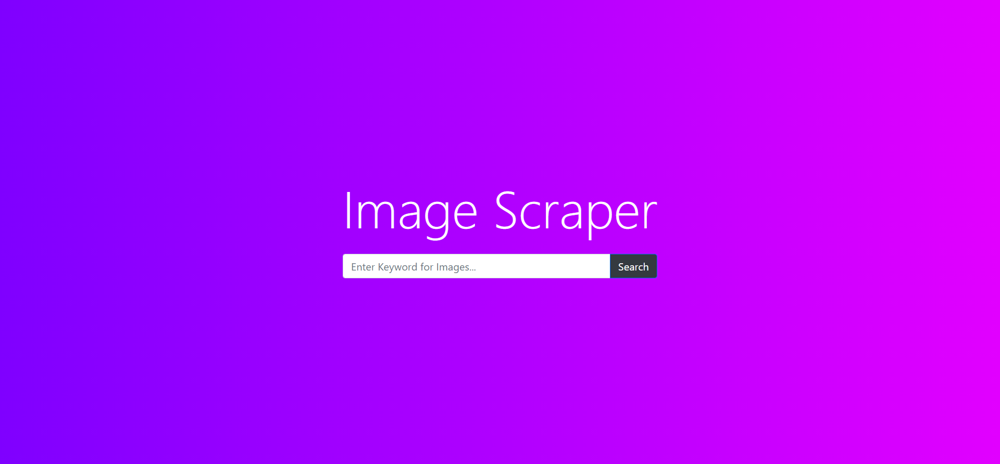
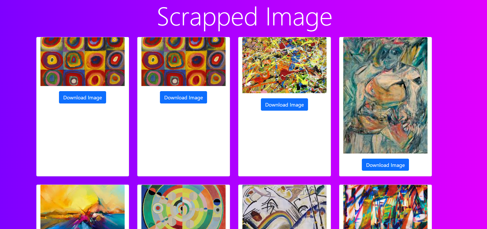

# 🚀 Image Scraper 🚀
This is a flask based web application which scraps images from google and display it in a download able format in website

# 👨‍💻 Technologies used

1. Python
2. Flask
3. Selenium

# How to run ☸ Application 
1. Install Python [click here](https://www.python.org/downloads/) 
2. Install pipenv
```commandline
pip install pipenv
```
3. go to project directory open terminal in that directory enter this command

this will start the enviroment
```commandline
pipenv shell 
```
4. Enter this to install dependencies
```commandline
pipenv install
```
5. Enter following command to start application
```commandline
py main.py
```

## Preview

1. **Home Screen**

   

1. **Images Screen**
